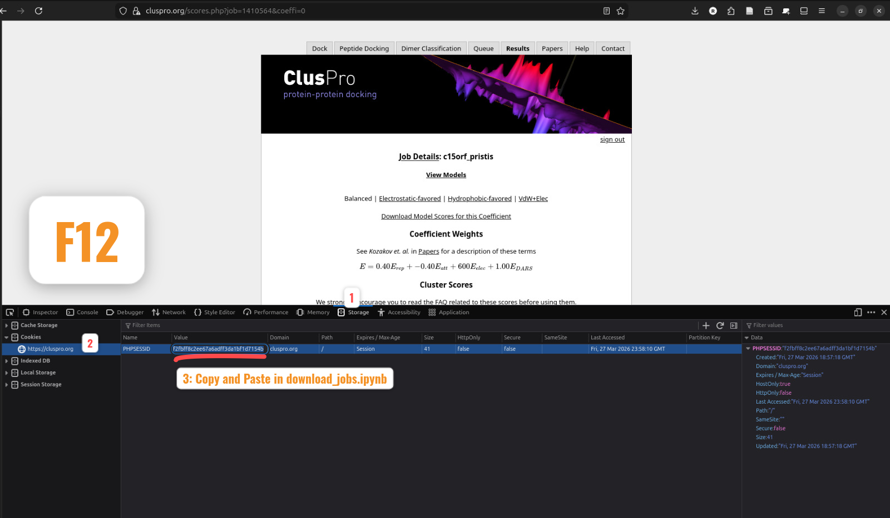
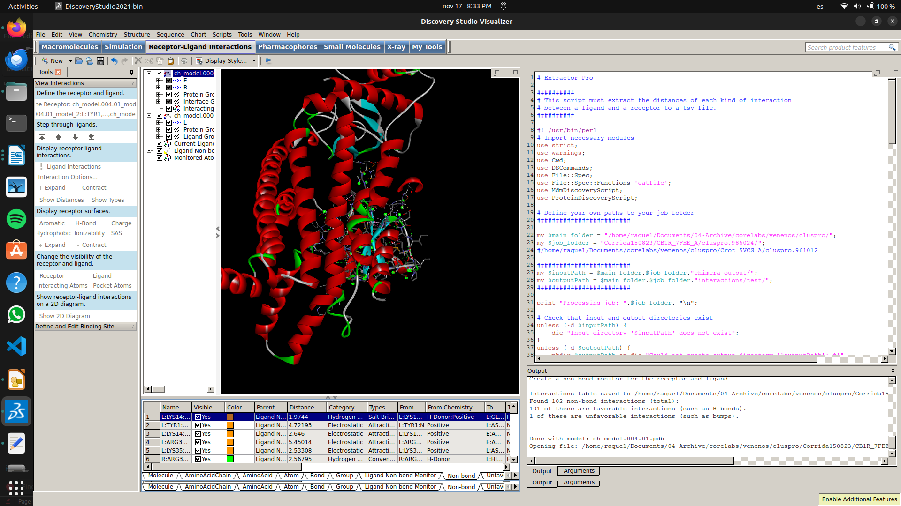

# docking-analysis
If you are a scientist **analysing interactions** between many different proteins, this code could be a great help to you in your research, saving you time and giving you the maximum amount of information. **Molecular docking** is a practical, cheap and "fast" way of predicting how two or more molecular structures interact. Is worth mention that there are more precise and detailed methods for predicticg interactions such as **molecular dynamics simulation**, however, if the number of simulations is elevated, this task become computationally expensive. That is why molecular docking can be used as a preliminary tool to predict interactions across many different molecules.

I developed this code for a research study that was looking for human receptors that were most prone to interact with a protein extracted from a rattlesnake venom called "crotamine." This way we could build an hypothesis on how will the venom will afect the body's metabolism and discover which pathways could be disrupting that could explain an observed rapid weight loss in cancer patiens treated with crotamine. Although, selection of human receptors according to molecular docking results is not a definitive way to determine its molecular mechanism, it can considerably reduce the search space between molecular candidates which shortens research time and saves resources within research. You can read about this research <a href="https://pubmed.ncbi.nlm.nih.gov/39180854/">here</a>. I also must thank David Melendez and Adriana Melendez for introducing me to this topic.

## How is it done?

This process is carried out thanks to the open access tool called <a href="https://cluspro.org/login.php">Cluspro</a> by the Vajda lab and the ABC group at Boston University and Stony Brook University. All jobs can be submitted here and after a few hours the results can be downloaded. Your results are ordered by two parameters: Score and Members. We can easily see which models have more possibilities to relate to what is really happening, but for some curators this is not enough information to determine if the molecular docking pose is relevant and accurate. This is where these new scripts come into the picture. The main goal is to increase the resolution when filtering the results, by extracting all possible non-bond interactions by type for each molecular docking pose. It's also helpful in studies where there's a comparison between a ligand and different receptors, not only to select the best fitting pose within a receptor, but also to select the best fitting receptor.

Before we continue, we need to look at the **main pipeline** of actions for each job:

1. The results are downloaded from cluspro and extracted into a dedicated folder.
2. All models (or poses) must be opened in UCSF Chimera and inmediately saved to correct the format in the pdf files
3. Open the models in BIOVA Discovery Studio Visualizer (DSV) to start the analysis.
5. Select the ligand and the receptor to display their interactions.
6. Save the results in a tsv (tab separated values) table
7. Interactions are grouped by type and counted
8. Finally, results are merged with the cluspro results and saved in a csv table.
9. Perform our desired analysis to select the best poses


> Please make sure you have <a href="https://www.cgl.ucsf.edu/chimera/download.html">UCSF Chimera</a> and <a href="https://discover.3ds.com/discovery-studio-visualizer-download">BIOVA Discovery Studio Visualizer</a> installed before proceeding.


## Instructions for usage
### 1. Download all files from cluspro results using `download_jobs.ipynb`
You can do it manually or automatically with the `download_jobs.ipynb`. You only need to change the path to your job list and update the cookie key that you get by opening ClusPro in your browser: Press `F12` to inspect window, go to `Storage`>`Cookies` and copy the value of your `PHPSESSID` cookie. 

This will download the .tat.bz2 file, uncompress it, and download the 4 models scores files available. Your download folder will have this structure:

```
.
├── cluspro_downloads
│   └── job_1410659
│       ├── cluspro.1410659
│       │   └── cluspro.1410659
│       │       ├── model.000.00.pdb
│       │       ├── ...
│       ├── cluspro.1410659.tar.bz2
│       ├── cluspro_scores.1410659.000.csv
│       ├── ...
│   └── job_1410660
│       ...
```
### 2. Run `save_all.py`
It's a python code that needs to be run within chimera environment, so the command for launching from the Unix-based terminal is 

```chimera --nogui save_all.py ```

It will create a directory in `./cluspro/Corrida######/jobname/clusproID/chimera_output` with all processed pdb files. 
This step is nessesary because Discovery Studio can not read directly the pdb files from cluspro.

### 3. Run `extract_interactions.pl`
This is an API integration script that opens each pdb docking file, select the ligand (in this case, selects specifically for crotamine as it is 42 residues long), and the rest of the molecules are considered as receptor. Then receptor-ligand interactions are calculated and the results are saved to a tsv file in the folder `./cluspro/Corrida######/jobname/clusproID/interactions`
When running several jobs, a list of job paths can be defined in line 19 (within @job_folders variable).

1. Open BIOVA DSV
2. Click on `File`>`New` and select `New Script Window`
3. Copy all the code from `extract_interactions.pl` and paste it in the script window
4. Update paths for your own jobs
5. Click run and wait (must take around 5 seconds per model or one minute per job)

Here is an example of how it looks when it's running:



### 4. Run `analyse_interactions.py`
This code can be run directy in the terminal with 

```python interaction_analysis.py```

It will create a new folder in `./interactions` (do not confuse with "./cluspro/jobname/clusproID/interactions")
Each job will have a final output called "JobName_JobID_analysis.csv" (example `AMYR_7TYF_R_969022_analysis.csv`)
It contains the extracted scores values, members and the count for each model's number of interactions by type


______

If you have ways to improve this code or need more information to properly run it, please <a href="mailto:raquel.cossior@gmail.com">send me an email</a>

Hope it is useful,

Raquel Cossío
______
